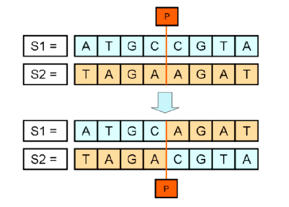
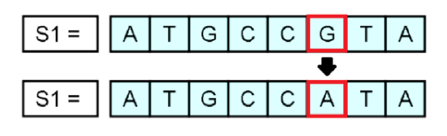

# Exercícios
1. Faça um programa para listar todos os divisores de um número ou dizer que o número é primo caso não existam divisores;
    * Ao final, verifique se o usuário deseja analisar outro número.

2. Faça um programa que, a partir de uma string digitada pelo usuário, imprima:
    * O número de caracteres da string;

    * A string com todas suas letras em maiúsculo;
    * O número de vogais da string;

    * Se a string digitada começa com "UNI" (ignorando maúsculas/minúsculas);

    * Se a string digitada termina com "RIO" (ignorando maiúsculas/minúsculas);

    * O número de digitos (0 a 9) da string;

    * Se a string é um palíndromo ou não.

3. Escreva um programa que, a partir de um nome informado pelo usuário, exiba suas iniciais:

    As iniciais são formadas pela primeira letra de cada nome, sendo que todas deverão aparecer em maiúsculas na saída do programa. Note que os conectores "e, do, da, dos, das, de, di, du" não são considerados para a obtenção das iniciais. As iniciais devem ser impressas em maiúsculas, ainda que o nome seja entrado todo em minúsculas.

    Exemplos:
    ```
    Maria das Graças Pimenta -> MGP;
    João Carlos dos Santos -> JCS;
    José da Silva -> JS;
    Pedro Pereira Teixeira -> PPT;
    ```
4. Um algoritmo genérico é uma técnica de inteligência artificial que se insira na forma como a natureza funciona e na teoria da evolução para resolver problemas complexos.

    Os algoritmos genéricos funcionam mantendo uma população de estruturas que evoluem de forma semelhante à evolução das espécies. A recombinação e a mutação são os operadores básicos de um algoritmo genérico.

    Considerando que os indivíduos da população são codificados através de strings, o operador de recombinação recebe duas strings S1 e S2, sorteia aleatoriamente um ponto de corte em S1 e S2 e, em seguida, realiza a troca de informações genéticas de S1 e S2, gerando dois novos indivíduos filhos. A figura abaixo ilustra o processo de recombinação:

    

5. O operador de mutação consiste em sortear aleatoriamente uma posição em um dos indivíduos filhos e, então, modificar aleatoriamente o conteúdo daquela posição. A figura abaixo ilustra o processo de mutação:

    

    Construa um programa em Java que implemente e utilize as funções de recombinação e mutação:

    * A função recombinação recebe como parâmetro 4 strings (S1, S2, S3, S4), onde S1 e S2 são as Strings representando os indivíduos pais e S3 e S4 devem retornar os dois indivíduos filhos gerados com a recombinação de S1 e S2. Ambas as strings devem possuir o mesmo tamanho;

    * A função mutação recebe como parâmetro uma string S1 e modifica o conteúdo de S1 realizando o processo de mutação. O seu programa deve ler duas strings S1 e S2 (de mesmo tamanho), fazer a recombinação dos dois indivíduos e aplicar uma mutação em um dos indivíduos resultantes.

    Por último, o programa deve exibir os 4 indivíduos da população (S1, S2, S3 e S4).